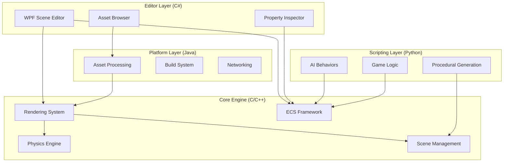

# PolyGameX

<div align="center">


**A Cross-Platform, Multi-Language Game Engine**

[]()
[](LICENSE)
[]()
[]()
[]()
[]()

</div>

## 🎮 Overview

PolyGameX is a high-performance, modular game engine designed to demonstrate advanced programming expertise across multiple languages. It combines low-level systems programming, cross-platform tooling, and AI-driven game development capabilities.

### Key Features

- 🎨 **Advanced Rendering** - OpenGL-based 2D/3D rendering with shader support
- ⚡ **Physics Simulation** - Custom physics engine with collision detection and rigid-body dynamics
- 🏗️ **Entity-Component-System** - Flexible ECS architecture for game object management
- 🖥️ **Visual Scene Editor** - Professional C# WPF editor with drag-and-drop interface
- 🤖 **AI & Procedural Generation** - Python-powered NPC behaviors and content generation
- 🌐 **Cross-Platform** - Windows, Linux, and macOS support
- 🔌 **Plugin System** - Extensible architecture for custom functionality
- 📊 **Performance Profiling** - Real-time debugging and performance analysis

## 🏗️ Architecture

PolyGameX demonstrates full-stack, multi-language development:



### Technology Stack

| Component | Language | Purpose |
|-----------|----------|---------|
| **Core Engine** | C/C++ | High-performance rendering, physics, memory management |
| **Scene Editor** | C# | Visual tools, GUI, plugin API |
| **Platform Modules** | Java | Asset processing, build system, networking |
| **AI & Scripting** | Python | Procedural generation, NPC AI, game logic |

## 🚀 Quick Start

### Prerequisites

- **C/C++**: CMake 3.15+, Visual Studio 2019+ or GCC 9+
- **C#**: .NET 6.0+ SDK
- **Java**: JDK 11+
- **Python**: 3.8+
- **OpenGL**: 4.3+ compatible GPU

### Building the Engine

#### Windows

```bash
# Clone the repository
git clone https://github.com/yourusername/PolyGameX.git
cd PolyGameX

# Build C++ engine core
mkdir build && cd build
cmake ..
cmake --build . --config Release

# Build C# editor
cd ../editor
dotnet build -c Release

# Build Java platform modules
cd ../platform
mvn clean package

# Install Python dependencies
cd ../scripts
pip install -e .
```

#### Linux/macOS

```bash
# Install dependencies (Ubuntu/Debian)
sudo apt-get install build-essential cmake libgl1-mesa-dev libx11-dev

# Build process same as Windows
mkdir build && cd build
cmake ..
make -j$(nproc)
```

### Running the Editor

```bash
# Windows
.\editor\bin\Release\PolyGameXEditor.exe

# Linux/macOS
./editor/bin/Release/PolyGameXEditor
```

## 📚 Documentation

- [Architecture Guide](docs/ARCHITECTURE.md) - Detailed technical architecture
- [API Reference](docs/API.md) - Complete API documentation
- [User Manual](docs/USER_MANUAL.md) - Editor and engine usage guide
- [Plugin Development](docs/PLUGINS.md) - Creating custom plugins
- [Examples](examples/) - Sample projects and tutorials

## 🎯 Core Modules

### Rendering System (C++)

- Modern OpenGL 4.3+ pipeline
- Shader compilation and management
- Texture loading (PNG, JPG, TGA)
- Mesh rendering with vertex buffers
- Camera system with perspective/orthographic projection

### Physics Engine (C++)

- Collision detection (AABB, Sphere, Mesh)
- Rigid body dynamics
- Constraint solving
- Spatial partitioning for optimization

### Entity-Component-System (C++)

- Data-oriented design for performance
- Component-based architecture
- System-based update loops
- Efficient entity management

### Scene Editor (C#)

- Drag-and-drop scene editing
- Real-time property editing
- Asset management and import
- Viewport with gizmos and selection
- Undo/redo system

### AI & Scripting (Python)

- A* pathfinding
- Behavior trees for NPC AI
- Procedural terrain generation (Perlin noise)
- Level generation algorithms
- Game logic scripting API

## 🔧 Project Structure

```
PolyGameX/
├── src/                    # C++ engine source
│   ├── core/              # Engine core systems
│   ├── rendering/         # Rendering subsystem
│   ├── physics/           # Physics engine
│   ├── ecs/               # Entity-Component-System
│   └── scene/             # Scene management
├── include/               # Public C++ headers
├── editor/                # C# WPF editor
│   ├── Views/            # UI views and controls
│   ├── Core/             # Editor core logic
│   └── API/              # Plugin API
├── platform/              # Java platform modules
│   └── src/main/java/    # Java source files
├── scripts/               # Python AI and scripting
│   ├── ai/               # AI behaviors
│   ├── procedural/       # Procedural generation
│   └── api/              # Scripting API
├── examples/              # Example projects
├── docs/                  # Documentation
└── external/              # Third-party libraries
```

## 🎨 Example Usage

### Creating a Simple Scene (Python)

```python
from polygamex import Scene, Entity, Transform, MeshRenderer

# Create a new scene
scene = Scene("MyScene")

# Add a cube entity
cube = Entity("Cube")
cube.add_component(Transform(position=(0, 0, 0)))
cube.add_component(MeshRenderer(mesh="cube", material="default"))

scene.add_entity(cube)

# Generate procedural terrain
from polygamex.procedural import TerrainGenerator

terrain = TerrainGenerator(width=100, height=100)
terrain.generate(seed=42, octaves=4, persistence=0.5)
scene.add_entity(terrain.to_entity())
```

### Custom AI Behavior (Python)

```python
from polygamex.ai import BehaviorTree, Sequence, Selector

class EnemyAI(BehaviorTree):
    def __init__(self, entity):
        super().__init__(entity)
        
        self.root = Selector([
            Sequence([
                self.check_player_in_range,
                self.attack_player
            ]),
            Sequence([
                self.find_player,
                self.move_to_player
            ]),
            self.patrol
        ])
```

## 🤝 Contributing

Contributions are welcome! This project is designed as a portfolio piece demonstrating multi-language expertise.

## 📄 License

This project is licensed under the MIT License - see the [LICENSE](LICENSE) file for details.

## 🌟 Showcase

PolyGameX demonstrates:

- ✅ Systems programming in C/C++
- ✅ GUI development with C# WPF
- ✅ Cross-platform Java development
- ✅ AI and scripting with Python
- ✅ Graphics programming (OpenGL)
- ✅ Physics simulation
- ✅ Software architecture and design patterns
- ✅ Build systems and DevOps

## 📞 Contact

**Project Link**: 

---

<div align="center">
Made with ❤️ by Tushar Singh Bisht
</div>
